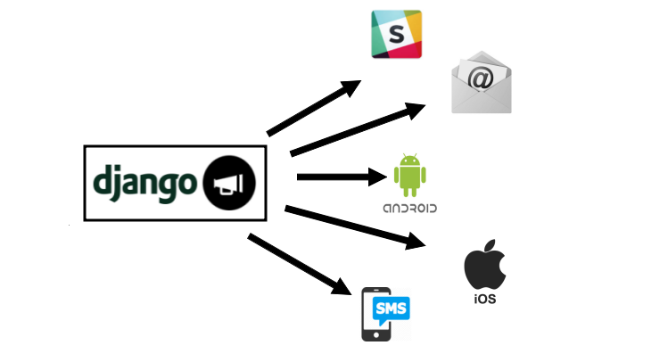

[](https://codeclimate.com/github/danidee10/django-notifs/maintainability)
[](https://codeclimate.com/github/danidee10/django-notifs/test_coverage)

## Notifications (InApp, Email, SMS, CustomBackend) for Django.



django-notifs is a notifications app for Django. Basically it allows you to notify users about events that occur in your application E.g

1. Your profile has been verified
2. User xxxx sent you a message

It also allows you to deliver these notifications to any destination you want to with custom delivery channels.

The Delivery channels are constantly updated, right now it has inbuilt delivery channels for:

- Emails
- RabbitMQ

It's very easy to extend and write your own custom delivery channel(s). Checkout <a href="#delivery-channels">Writing custom delivery channels</a> to learn how to write your own delivery channel.

django-notifs uses <a href="#celery">Celery</a> to process notifications in the background so requests don't block and you can queue and retry failed notifications.

## Installation

Get it from pip with:

```bash
pip install django-notifs
```

Include it in `INSTALLED_APPS`

```python
INSTALLED_APPS = (
    'django.contrib.auth',
    ...
    'notifications',
    ...
)
```

Include the urls in urls.py

```python
urlpatterns = [
    ...
    url('^notifications/', include('notifications.urls', namespace='notifications')),
    ...
]
```

Finally don't forget to run the migrations with

```bash
python manage.py migrate notifications
```

### Sending Notifications

Previously, django-notifs used [Django signals](https://docs.djangoproject.com/en/2.2/topics/signals/) to send and read notifications. If you use version <=2.6.2 Please read the [Using signals section](#signals).

To Create/Send a notification import the notify function and call it with the following arguments.

```python
from notifications.utils import notify

kwargs = {
    'source': self.request.user,
    'source_display_name': self.request.user.get_full_name(),
    'recipient': recipent_user, 'category': 'Chat',
    'action': 'Sent', 'obj': message.id,
    'short_description': 'You a new message', 'url': url,
    'channels': ('email', 'websocket', 'slack'), 'silent': True
}
notify.send(**kwargs)
```

The example above would create a notification and deliver it via email, websocket and slack. *This assumes that you've implemented those channels and added them to the NOTIFICATIONS_CHANNELS dictionary.*

### Notification Fields

The fields in the `args` dictionary map to the fields in the `Notification` model

- **source: A ForeignKey to Django's User model (Can be null if it's not a User to User Notification).**
- **source_display_name: A User Friendly name for the source of the notification.**
- **recipient: The Recipient of the notification. It's a ForeignKey to Django's User model.**
- **category: Arbitrary category that can be used to group messages.**
- **action: Verbal action for the notification E.g Sent, Cancelled, Bought e.t.c**
- **obj: The id of the object associated with the notification (Can be null).**
- **short_description: The body of the notification.**
- **url: The url of the object associated with the notification (Can be null).**
- **silent: If this Value is set, the notification won't be persisted to the database.**
- **extra_data: Arbitrary data as a dictionary.**
- **channels: Delivery channels that should be used to deliver the message (Tuple/List)**

The values of the fields can easily be used to construct the notification message.

### Extra/Arbitrary Data

Apart from the standard fields, django-notifs allows you to attach arbitrary data to a notification.
Simply pass in a dictionary as the extra_data argument.

**NOTE: The dictionary is serialized using python's json module so make sure the dictionary contains objects that can be serialized by the json module**

Internally, the JSON is stored as text in django's standard `TextField` so it doesn't use database-specific JSON fields.

### Reading notifications

To read a notification use the read method like this:

```python
from notifications.utils import read

# id of the notification object, you can easily pass this through a URL
notify_id = request.GET.get('notify_id')

# Read notification
if notify_id:
    read(notify_id=notify_id, recipient=request.user)
```

It's really important to pass the correct recipient to the read signal, Internally it's used to check if the user has the right to read the notification. If you pass in the wrong recipient or you omit it entirely, `django-notifs` would raise a
`NotificationError`

### Accessing Notifications in templates

django-notifs comes with a Context manager that you can use to display notifications in your templates. Include it with

 ```bash
'context_processors': [
    ...
    'notifications.notifications.notifications',
    ...
],
```

This makes a user's notifications available in all templates as a template variable named "notifications"

<h3 id="delivery-channels">Writing custom delivery channels</h3>

django-notifs doesn't just allow you to send in app notifications. you can also send external notifications (Like Emails and SMS) by using custom delivery channels. A delivery channel is a python class that provides two methods:

1. `construct_message` to construct the message.

2. `notify` does the actual sending of the message.

There's a base meta class you can inherit. This is an example of an email delivery channel using `django.core.mail.send_mail`:

```python

from django.core.mail import send_mail
from notifications.channels import BaseNotificationChannel

class EmailNotificationChannel(BaseNotificationChannel):
    """Allows notifications to be sent via email to users."""

    def construct_message(self):
        """Constructs a message from notification arguments."""
        kwargs = self.notification_kwargs
        category = kwargs.get('category', None)
        short_description = kwargs.get('short_description', None)

        message = '{} {} {}'.format(
            kwargs['source_display_name'], kwargs['action'],
            short_description
        )

        return message

    def notify(self, message):
        """Send the notification."""
        subject = 'Notification'
        from_email = 'your@email.com'
        recipient_list = ['example@gmail.com']

        send_mail(subject, message, from_email, recipient_list)

```

Finally don't forget to tell `django-notifs` about your new Delivery Channel by setting:


```python

NOTIFICATIONS_CHANNELS = {
    'email': 'path.to.EmailNotificationChannel'
}

```

<h3 id="celery">Sending notifications asynchronously</h3>

You don't need to do anything special here, `django-notifs` already installs celery as part of it's dependencies. You just need to setup celery like [you'd normally do](http://docs.celeryproject.org/en/latest/django/first-steps-with-django.html) make sure you have a broker installed (RabbitMQ or Redis) and run celery. Whenever a notification is created, it would be automatically sent to celery and processed.

**Make sure you see the task registered under celery as  notifications.tasks.send_notification**


*If you have issues registering the task, you can import it manually or checkout the [celery settings in this repo](notifs/settings.py)*

If you want to disable celery and send notifications synchronously you can always set `CELERY_TASK_ALWAYS_EAGER` to `True`.


## Websockets

This is the coolest part of this library, Unlike other django notification libraries that provide a JavaScript API that the client call poll at regular intervals, django-notifs supports websockets (thanks to `uWSGI`). This means you can easily alert your users when events occur in your application, You can use it to build a chat application etc

To actually deliver notifications, `django-notifs` uses RabbitMQ as a message queue to store notifications which are then consumed and sent over the websocket to the client.

To enable the Websocket functionality simply set:

```bash
NOTIFICATIONS_USE_WEBSOCKET = True
```

and set the URL to your RabbitMQ Server with:

```bash
NOTIFICATIONS_RABBIT_MQ_URL = 'YOUR RABBIT MQ SERVER'
```

This will tell django-notifs to publish messages to the rabbitmq queue.

Under the hood, django-notifs adds a new channel to `NOTIFICATIONS_CHANNELS` which contains the logic for delivering the messages to RabbitMQ. If you need more advanced features that RabbitMQ offers like [Pub/Sub](https://www.rabbitmq.com/tutorials/tutorial-one-python.html) or you want to use a different message queue like Redis, all you need to do is write your own delivery channel and add it to `NOTIFICATIONS_CHANNELS`.

### Running the websocket server

Due to the fact that Django itself doesn't support websockets, The Websocket server has to be started separately from your main application with uwsgi. For example to start the `WebSocket` Server with `gevent` you can do this:

```bash
uwsgi --http :8080 --gevent 100 --module websocket --gevent-monkey-patch --master --processes 4
```

There is a sample echo websocket server in the `examples` directory.

### How to listen to notifications

At the backend, A Rabbitmq queue is created for each user based on the username, so when you're connecting to the websocket server you have to pass the username in the websocket url. For example to listen to messages for a username `danidee` connect to this url (Assuming the websocket server is running on `localhost` and port `8080`)

```JavaScript
var websocket = new WebSocket('ws://localhost:8080/danidee')
```

### Writing tests

django-notifs comes with an inbuilt console delivery channel that just prints out the notification arguments.

```python
NOTIFICATIONS_CHANNELS = {
    'console': 'notifications.channels.ConsoleChannel'
}
```

This can be helpful during development.

### Examples?

I've written a tutorial on how to build a [Realtime Chat application Vue, django-notifs, RabbitMQ and uWSGI](https://danidee10.github.io/2018/01/01/realtime-django-1.html).

The Repository for the chat app (Chatire) is also available on [github](https://github.com/danidee10/chatire)

### Supported Python versions

Python 3.5, 3.6 and 3.7.
*It should still work with older versions of python but I can't guarantee it*


<h3 id="signals">Using signals</h3>

Previously, django-notifs used [Django signals](https://docs.djangoproject.com/en/2.2/topics/signals/) to send and read notifications. This has been deprecated in favour of pure Python functions.

To Create/Send a notification import the notify signal and send it with the following arguments.

```python
from notifications.signals import notify

kwargs = {
    'source': self.request.user,
    'source_display_name': self.request.user.get_full_name(),
    'recipient': recipent_user, 'category': 'Chat',
    'action': 'Sent', 'obj': message.id,
    'short_description': 'You a new message', 'url': url,
    'channels': ('email', 'websocket', 'slack'), 'silent': True
}
notify.send(sender=self.__class__, **kwargs)
```

To Read a notification use this:

```python
from notifications.signals import read

# id of the notification object, you can easily pass this through a URL
notify_id = request.GET.get('notify_id')

# Read notification
if notify_id:
    read.send(
        sender=self.__class__, notify_id=notify_id,
        recipient=request.user
    )
```

It's really important to pass the correct recipient to the read signal, Internally it's used to check if the user has the right to read the notification. If you pass in the wrong recipient or you omit it entirely, `django-notifs` would raise a
`NotificationError`

### TODO

- Document with Sphinx
