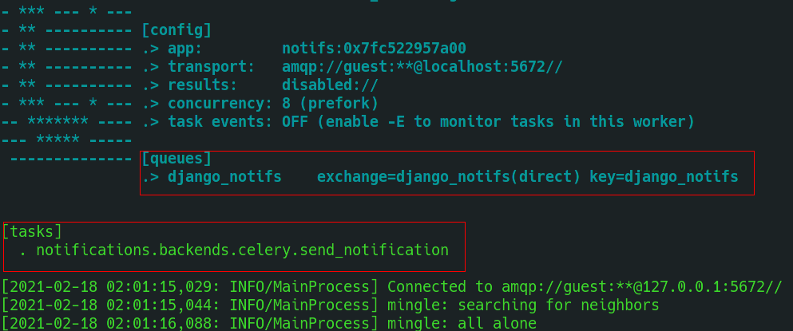
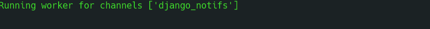
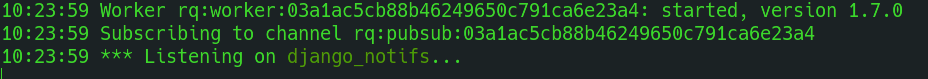

Backends
********

.. _you'd normally do: http://docs.celeryproject.org/en/latest/django/first-steps-with-django.html
.. _Celery settings in the repo: https://github.com/danidee10/django-notifs/blob/master/notifs/settings.py
.. _django-rq: https://github.com/rq/django-rq
.. _django-rq documentation: https://github.com/rq/django-rq

The primary function of **a delivery backend** is to execute the code of the delivery channels.
*Unlike delivery channels, you can only use one delivery backend at the same time.*

Celery
------

Install the optional Celery dependency with::

    pip install django-notifs[celery]

Enable it by setting ``NOTIFICATIONS_DELIVERY_BACKEND`` to ``notifications.backends.Celery``

Run celery with the command::

    celery -A yourapp worker -l info -Q django_notifs

Whenever a notification is created, it's automatically sent to celery and processed.

**Make sure you see the queue and task (notifications.backends.celery.send_notification) in the terminal**

If you have issues registering the task, you can import it manually or checkout the `Celery settings in the repo`_.

Channels
--------

Install the channels dependency with::

    pip install django-notifs[channels]

*This also installs channels_redis as an extra dependency*

Declare the notifications consumer in ``asgi.py``::

    from notifications import consumers

    application = ProtocolTypeRouter({
        ...,
        'channel': ChannelNameRouter({
            'django_notifs': consumers.DjangoNotifsConsumer.as_asgi(),
        })
    })

*This example assumes that you're running Django 3x Which has native support for asgi. Check the channels documentation for Django 2.2*

Next add the `django_notifs` channel layer to ``settings.CHANNEL_LAYERS``::

    CHANNEL_LAYERS = {
        ...,
        'django_notifs': {
            'BACKEND': 'channels_redis.core.RedisChannelLayer',
            'CONFIG': {
                "hosts": [('127.0.0.1', 6379)],
            },
        },
    }

Finally, run the worker with::

    python manage.py runworker django_notifs

RQ
--

RQ is a lightweight alternative to Celery. To use the RQ Backend, install the optional dependency with::
    
    pip install django-notifs[rq]

*django notifs uses django-rq under the hood*

Enable it by setting ``NOTIFICATIONS_DELIVERY_BACKEND`` to ``notifications.backends.RQ``

Configure the ``django_notifs`` in ``settings.py``::

    RQ_QUEUES = {
        ...,
        'django_notifs': {
            'HOST': 'localhost',
            'PORT': 6379,
            'DB': 0,
            'PASSWORD': '',
            'DEFAULT_TIMEOUT': 360,
        }
    }

Finally start the rq worker with::

    python manage.py rqworker django_notifs --with-scheduler

See the `django-rq documentation`_ for more details

Synchronous
-----------
This is the default backend that sends notifications synchronously.

You can enable it explicitly by setting ``NOTIFICATIONS_DELIVERY_BACKEND`` to ``notifications.backends.Synchronous``
