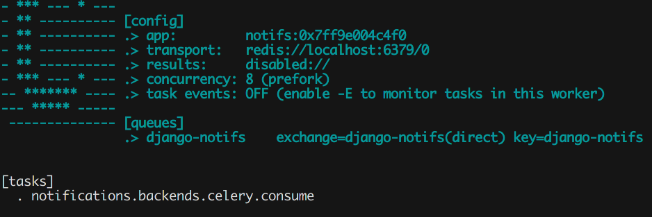

Backends
********

.. _Celery settings in the repo: https://github.com/danidee10/django-notifs/blob/master/notifs/settings.py
.. _django-rq: https://github.com/rq/django-rq
.. _django-rq documentation: https://github.com/rq/django-rq
.. _Serverless documentation for AWS: https://www.serverless.com/framework/docs/providers/aws
.. _lambda worker repository: https://github.com/danidee10/django-notifs-lambda-worker

The primary function of **a delivery backend** is to execute the code of the delivery channels and providers.
*Unlike notification channels, you can only use one delivery backend at a time.*

Celery
------

Install the optional Celery dependency with::

    pip install django-notifs[celery]

Enable it by setting ``NOTIFICATIONS_DELIVERY_BACKEND`` to ``notifications.backends.Celery``

Run celery with the command::

    celery -A yourapp worker -l info -Q django-notifs

Whenever a notification is created, it's automatically sent to celery and processed.

Make sure you see the queue and task (``notifications.backends.celery.consume``) in the terminal.

If you have issues registering the task, you can import it manually or checkout the `Celery settings in the repo`_.

Channels
--------

Install the channels dependency with::

    pip install django-notifs[channels]

*This also installs channels_redis as an extra dependency*

Declare the notifications consumer in ``asgi.py``::

    from notifications import consumers

    application = ProtocolTypeRouter({
        ...,
        'channel': ChannelNameRouter({
            'django_notifs': consumers.DjangoNotifsConsumer.as_asgi(),
        })
    })

*This example assumes that you're running Django 3x Which has native support for asgi. Check the channels documentation for Django 2.2*

Next add the `django_notifs` channel layer to ``settings.CHANNEL_LAYERS``::

    CHANNEL_LAYERS = {
        ...,
        'django_notifs': {
            'BACKEND': 'channels_redis.core.RedisChannelLayer',
            'CONFIG': {
                "hosts": [('127.0.0.1', 6379)],
            },
        },
    }

Finally, run the worker with::

    python manage.py runworker django_notifs

.. image:: _static/images/channels.png

RQ
--

RQ is a lightweight alternative to Celery. To use the RQ Backend, install the optional dependency with::
    
    pip install django-notifs[rq]

*django notifs uses django-rq under the hood*

Enable it by setting ``NOTIFICATIONS_DELIVERY_BACKEND`` to ``notifications.backends.RQ``

Configure the ``django_notifs`` in ``settings.py``::

    RQ_QUEUES = {
        ...,
        'django_notifs': {
            'HOST': 'localhost',
            'PORT': 6379,
            'DB': 0,
            'PASSWORD': '',
            'DEFAULT_TIMEOUT': 360,
        }
    }

Finally start the rq worker with::

    python manage.py rqworker django_notifs --with-scheduler

See the `django-rq documentation`_ for more details

AwsLambda (with SQS)
--------------------

The setup for this backend is more involved but it's probably the cheapest and most scalable backend to use in production
because the heavylifting and execution environment is handled by AWS.

set ``NOTIFICATIONS_DELIVERY_BACKEND`` to ``notifications.backends.AwsSqsLambda``

Clone the `lambda worker repository`_ and run::

    npm install

The ``sqs-lambda-worker`` folder includes four files that are of interest:

``.env.example``

You can use this file (after renaming it to ``.env``) to configure the environment variables for the autogenerated Lambda function.
You can replace this step by:
    - Configuring the environment variables in your CI/CD environment **(Recommended)**
    - Exporting them in the current shell.
This is useful if you want to test the serverless deployment locally before moving it to your CI/CD

``requirements.txt``

In order to keep the lambda function as lean as possible,
you have to explicitly declare the requirements that are necessary
for the lambda function. New providers (and their dependencies) are continuously added to django-notifs
so it's not adviseable to install dependencies for providers that you don't need because this could impact
the startup time of your Lambda function.

``serverless.yml``

The Serverless file. It contains a blueprint that deploys the simplest configuration possible but the configuration options
are endless. see the `Serverless documentation for AWS`_ for more information.

``settings.py``

Declare the Django settings for the lambda function

Synchronous
-----------
This is the default backend that sends notifications synchronously.

You can enable it explicitly by setting ``NOTIFICATIONS_DELIVERY_BACKEND`` to ``notifications.backends.Synchronous``
